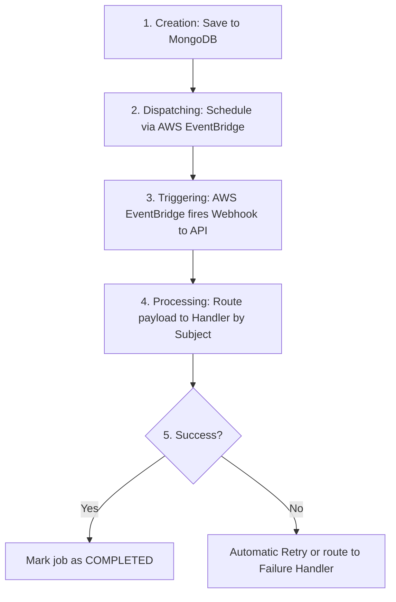

#  Background Job Manager

A robust, event-driven Node.js microservice designed to orchestrate, schedule, and process asynchronous background jobs. 

Whether you need to send bulk notifications, process large files, or sync databases, this service offloads heavy tasks from your main application so it can remain fast and responsive.

---

##  How It Works (The Lifecycle of a Job)

1. **Creation:** A job is created and saved to the MongoDB database (`clt_background_jobs`) with a `queued` pending status.
2. **Dispatching:** The system uses **AWS EventBridge Scheduler** to schedule the job for immediate or future execution.
3. **Triggering:** At the scheduled time, AWS EventBridge sends a secure Webhook back to this application's API.
4. **Processing:** The system routes the webhook to the correct **Handler** based on the job's "Subject" (e.g., `user:sync`).
5. **Completion/Retry:** If successful, the job is marked `COMPLETED`. If it fails, it is automatically retried based on configured limits, or sent to a **Failure Handler**.



---

##  Features

- **AWS EventBridge Integration**: Native scheduling and dispatching using `@aws-sdk/client-scheduler` and `@aws-sdk/client-eventbridge`.
- **Secure Webhooks**: Verifies incoming AWS Lambda/EventBridge invocations using HTTP headers (`x-event-secret`).
- **Modular Architecture**: Clean separation of concerns with dedicated handlers for processing jobs and handling failures.
- **Database Tracking**: Jobs are tracked and persisted using MongoDB (`clt_background_jobs` collection).
- **Automatic Retries**: Built-in retry mechanism with customizable attempt limits per job type.

---

##  Project Structure

```text

```
src/
├── lib/background-job-worker/
│   ├── background-job-manager.js    ← core: orchestrates everything
│   ├── event-bridge-dispatcher.js   ← immediate dispatch via EventBridge PutEvents
│   ├── scheduler-dispatcher.js      ← delayed dispatch via EventBridge Scheduler
│   ├── SqsDispatcher.js             ← optional: high-throughput via SQS
│   ├── BullMQDispatcher.js          ← optional: no-AWS via Redis/BullMQ
│   └── BullMQWorker.js              ← optional: worker for BullMQ dispatcher
│
├── services/background-jobs/
│   ├── index.js                   ← AWS config + manager singleton (only file that reads .env)
│   ├── subjects.js                ← all job type strings in one place
│   ├── handlers/                  ← your business logic, one file per domain
│   │   ├── index.js               ← registers all handlers on the manager
│   │   ├── notification.handler.js
│   │   ├── user.handler.js
│   │   ├── post.handler.js
│   │   └── report.handler.js
│   └── failure-handlers/          ← what to do when a job permanently fails
│       ├── index.js               ← registers all failure handlers
│       ├── notification.failure.js
│       └── user.failure.js
│
├── controllers/
│   └── background-jobs.controller.js
├── routes/
│   ├── background-jobs.route.js   ← REST API: trigger, list, get, retry
│   └── lambda.routes.js           ← /api/lambda/jobs — Lambda webhook
├── models/
│   └── clt_background_jobs.js     ← Mongoose schema, single document per job
├── config/
│   └── database.js
├── app.js
└── server.js
```


---


##  Installation & Setup

### Prerequisites
- MongoDB instance (local or MongoDB Atlas)
- AWS Account 

### 1. Clone the repository
```bash
git clone https://github.com/emilomanishm/background-job-manager.git
cd background-job-manager
```

### 2. Install dependencies
```bash
npm install
```

### 3. Environment Variables
Create a `.env` file in the root directory. 


```env
# Server & Database
PORT=3000
MONGO_URI=mongodb://localhost:27017/your-database

# AWS Configuration (Used by EventBridge Dispatcher)
AWS_REGION=ap-south-1
AWS_ACCESS_KEY_ID=your_aws_access_key
AWS_SECRET_ACCESS_KEY=your_aws_secret_key

# AWS Lambda/Scheduler Targets
AWS_LAMBDA_ARN=arn:aws:lambda:ap-south-1:123456789012:function:your-function
AWS_SCHEDULER_ROLE_ARN=arn:aws:iam::123456789012:role/your-scheduler-role

# Webhook Security (Must match the header sent by AWS)
LAMBDA_WEBHOOK_SECRET=your_super_secret_webhook_token
```

### 4. Run the Application

**Development Mode (Auto-reloads on file changes):**
```bash
npm run dev
```

**Production Mode:**
Runs the standard Node.js server.
```bash
npm start
```

## Job Subjects (Topics)

The application routes incoming tasks based on predefined subjects. The following subjects are currently supported in `src/services/background-jobs/subjects.js`:

- **User Operations**: 
  - `user:sync`
  - `user:update`
  - `user:delete`
- **Notifications**: 
  - `notification:send`
  - `notification:bulk`
- **Post Processing**: 
  - `post:process`
  - `post:analyze`
- **Reporting**: 
  - `report:generate`
  - `report:export`

---

## API Routes

The Express application exposes HTTP endpoints to receive webhooks and manage tasks. These are divided into two main files:

### 1. Webhook Routes (`src/routes/lambda.routes.js`)
These routes act as the bridge between AWS and your application. When AWS EventBridge Scheduler triggers a job, it makes a secure `POST` request to this route. The route intercepts the payload and passes it directly to the `BackgroundJobManager` for execution.

| Method | Path | Description |
|--------|------|-------------|
| POST | `/api/lambda/jobs` | Lambda webhook (internal) |


### 2. Management Routes (`src/routes/background-jobs.route.js`)
These are internal API endpoints used by your main application to interact with the job system. Typically, these include endpoints to manually create/dispatch a new job, retrieve the execution status of a pending job, or manually retry a failed job.

| Method | Path | Description |
|--------|------|-------------|
| POST | `/api/v1/background-jobs/trigger` | Enqueue a new job |
| GET  | `/api/v1/background-jobs` | List jobs (filter by status, subject) |
| GET  | `/api/v1/background-jobs/:jobId` | Fetch single job |
| POST | `/api/v1/background-jobs/:jobId/retry` | Re-enqueue a failed job |

---

##  Webhook Security

When AWS EventBridge/Lambda triggers a job execution, it hits the webhook endpoint defined in `lambda.routes.js`. 

This request is verified by the `verifyHttp` function inside `src/services/background-jobs/index.js`, which ensures that the `x-event-secret` header passed in the request matches your local `LAMBDA_WEBHOOK_SECRET` environment variable.


# background-job-manager — Deep Dive

> **File:** `src/lib/background-job-worker/background-job-manager.js`
>
> This is the heart of the entire system. Every other file either feeds into it or is called by it. Your application code only ever calls one method on it directly: `trigger()`.

---

## The big picture

```
Your app                   background-job-manager              External
──────────                 ────────────────────              ────────
trigger() ────────────────► saves to MongoDB
                           ► calls dispatcher.trigger() ──► AWS Scheduler

                           (time passes — Scheduler fires)

                           ◄── Lambda POSTs /api/lambda/jobs
middleware() ◄─────────────── verifyHttp() checks HMAC
                           ► responds 200 immediately
                           ► setImmediate(_process())

                           _process() runs:
                             ► reads job from MongoDB
                             ► runs your handler()
                             ► success → status: completed
                             ► failure → runs onFailure()
                                        → ctx.reschedule()
                                        → same doc re-dispatched
```

**One rule:** Your code calls `trigger()`. AWS calls `middleware()`. Everything else is internal.

---

## Constructor

```js
new BackgroundJobManager({
  dispatcher,   // required — any dispatcher (Scheduler, SQS, BullMQ...)
  model,        // required — Mongoose model
  platform,     // optional — stored on each job, e.g. 'emilo'
  options: {
    defaultRetries: 3,       // maxAttempts = retries + 1
    timeout:        30_000,  // per-handler timeout in ms
    verifyHttp:     fn,      // (req) => boolean — signature verification
  }
})
```

The constructor stores `dispatcher` and `model` as instance properties and initialises two `Map` objects:
- `this.handlers` — subject string → `{ callback, opts }`
- `this.failureHandlers` — subject string → callback, or `'*'` → global fallback

---

## Public methods

### `trigger(subject, payload, opts)`

**What it does:**
1. Resolves delay — `delayMinutes` is converted to ms. `delayMinutes` takes priority over `delayMs`.
2. Generates a UUID `jobId`.
3. Creates the job document in MongoDB with `status: 'queued'`, `attempts: 0`.
4. Calls `this.dispatcher.trigger({ jobId, subject, payload, delayMs })`.
5. Returns `{ jobId, status, delayMs, messageId, runAt? }`.

**Where `maxAttempts` comes from:**
```
maxAttempts = (opts.retries ?? this.options.defaultRetries) + 1
```
So `retries: 3` → `maxAttempts: 4` — meaning 4 total runs before permanent failure.

**Options:**

| Option | Type | Description |
|---|---|---|
| `delayMinutes` | number | Fire N minutes from now. Takes priority over `delayMs`. |
| `delayMs` | number | Fire N milliseconds from now. |
| `retries` | number | Max reschedule cycles. `maxAttempts = retries + 1`. |
| `priority` | string | `low` / `normal` / `high`. Stored on document, display only. |
| `meta` | object | Extra data. Available as `ctx.meta` inside your handler. |

```js
// Immediate
await manager.trigger('notification:send', { email: 'user@example.com', template: 'welcome' })

// Delayed 30 minutes, 5 reschedule cycles allowed
await manager.trigger('report:generate', { reportType: 'monthly' }, {
  delayMinutes: 30,
  retries:      5,
  meta:         { triggeredBy: 'cron' },
})
```

---

### `handler(subject, callback, opts)`

**What it does:** Stores your function in `this.handlers` keyed by subject. Called once at startup from `registerHandlers()`. Does nothing at call time — the callback is invoked later by `_process()`.

**The callback signature:**

```js
async function myHandler(payload, ctx) {
  // payload — the data you passed to trigger()
  // ctx     — system data provided by the manager

  ctx.jobId    // 'a3f8c1d2-...'
  ctx.subject  // 'notification:send'
  ctx.meta     // whatever you passed in opts.meta
  ctx.attempts // runs completed BEFORE this one (0 on first run)

  // Throw to fail the job → failure handler fires
  // Return normally → job marked completed
}
```

**The `attempts` value in `ctx`:**

`ctx.attempts` is snapshotted from `job.attempts` **before** the update that increments it. So:
- First run: `ctx.attempts === 0` (zero runs before this one)
- Second run: `ctx.attempts === 1` (one run before this one)

This lets you change behaviour on retries:
```js
async function handler(payload, ctx) {
  if (ctx.attempts === 0) {
    await fullAttempt(payload)    // first run — try everything
  } else {
    await simpleFallback(payload) // retry — simpler approach
  }
}
```

**opts:**

| Option | Type | Description |
|---|---|---|
| `timeout` | number | Per-handler timeout in ms. Overrides `options.timeout` from constructor. |

The `retries` option previously used with RetryManager is now unused — retry cycles are controlled by `opts.retries` in `trigger()`.

---

### `onFailure(subjectOrCallback, callback?)`

**What it does:** Stores failure callbacks in `this.failureHandlers`. Two calling patterns:

```js
// Subject-specific
manager.onFailure('notification:send', notificationFailureHandler)

// Global fallback (fires when no subject-specific handler matches)
manager.onFailure(async (payload, ctx) => { ... })
```

Global fallback is stored under the key `'*'`. When `_runFailure()` looks up the handler, it tries the subject key first, then falls back to `'*'`.

**The failure handler signature:**

```js
async function myFailureHandler(payload, ctx) {
  ctx.jobId       // failed job ID
  ctx.subject     // 'notification:send'
  ctx.lastError   // the Error object thrown by your handler
  ctx.meta        // original opts.meta from trigger()
  ctx.attempts    // runs done INCLUDING this failed one
  ctx.maxAttempts // total allowed (retries + 1)
  ctx.reschedule  // async (delayMinutes?) => { jobId, messageId, runAt }
}
```

**The loop guard pattern:**
```js
async function failureHandler(payload, ctx) {
  if (ctx.attempts >= ctx.maxAttempts) {
    // All runs exhausted — alert ops, give up
    return
  }
  await ctx.reschedule(30) // retry in 30 minutes
}
```

---

### `middleware()`

**What it does:** Returns an Express request handler attached to `POST /api/lambda/jobs`. This is how AWS Scheduler gets a message back to your server after a job fires.

**Sequence inside `middleware()`:**

```
1. Checks this.options.verifyHttp is configured → 401 if not
2. Calls verifyHttp(req) → 401 if fails
3. Reads { jobId, subject, payload } from req.body → 400 if missing
4. res.status(200).json({ ok: true, jobId })   ← responds IMMEDIATELY
5. setImmediate(() => this._process(...))        ← processes AFTER response
```

**Why `setImmediate`?** Lambda has a timeout. If the server waited for `_process()` to finish before responding, Lambda would time out on long jobs. Responding immediately lets Lambda close cleanly. The job processes in the background.

**Signature verification:**

`verifyHttp` is passed in from `services/background-jobs/index.js`. It reads `req.rawBody` (the raw bytes captured before `express.json()` runs) and computes HMAC-SHA256. Using raw bytes ensures the signature matches exactly what Lambda signed — re-serialising `req.body` via `JSON.stringify` can differ in key order.

---

## Private methods

### `_process(jobId, subject, payload)` — the core

This runs on every Lambda invocation. It is the most important private method.

**Step by step:**

```
1. Read job from MongoDB
   → if not found: return
   → if status === 'completed': return (idempotency)
   → if status === 'processing' && updatedAt < 10 min ago: return (still running)

2. Check handlers Map for subject
   → if not found: status='failed', log entry, return

3. Snapshot previousAttempts = job.attempts
   runNumber = previousAttempts + 1

4. Update MongoDB:
   status='processing', startedAt=now, attempts=runNumber
   logs.push({ attempt: runNumber, status: 'processing', ... })

5. Call callback(payload, ctx) with timeout wrapper
   → timeout default: 30,000ms (from options or handler opts)

6a. Success:
    status='completed', completedAt=now, lastError=null
    logs.push({ ..., status: 'completed' })

6b. Failure (throws):
    status='failed', failedAt=now, lastError=err.message
    logs.push({ ..., status: 'failed' })
    → _runFailure(subject, payload, ctx)
       ctx includes reschedule() fn
```

**The idempotency guard** is critical. Lambda can deliver the same event twice. Without the guard, a job could be processed twice — sending two emails, charging twice, etc. The 10-minute window allows re-processing of genuinely stuck jobs.

**The `$push` / `$set` separation** in `_update()`:

Mongoose requires `$push` and `$set` to be siblings at the top level of the update document. Spreading `$push` into the top-level object alongside plain fields causes it to be treated as a regular field and silently ignored — logs never write. `_update()` separates them:

```js
_update(jobId, fields) {
  const { $push, ...rest } = fields
  const update = {}
  if (Object.keys(rest).length > 0) update.$set = { ...rest, updatedAt: new Date() }
  if ($push) update.$push = $push
  return this.model.findOneAndUpdate({ jobId }, update, { new: true })
}
```

---

### `_runFailure(subject, payload, ctx)`

Looks up the failure handler: subject-specific first, then `'*'`. Wraps the call in try/catch so a crashing failure handler cannot bubble up.

---

### `_withTimeout(promise, ms, jobId)`

Wraps a promise with a timeout. Resolves normally if the promise resolves before `ms`. Rejects with a timeout error otherwise. Clearing the timeout on both paths prevents memory leaks.

---

## How `reschedule()` works inside `_process()`

```js
reschedule: async (delayMinutes = 60) => {
  const delayMs = Math.round(delayMinutes * 60 * 1000)

  // 1. Reset the existing document — same jobId, no new document
  await this._update(jobId, {
    status:    'queued',
    lastError: null,
    failedAt:  null,
  })

  // 2. Re-dispatch the same jobId
  const result = await this.dispatcher.trigger({
    jobId,      // ← SAME jobId
    subject,
    payload,
    platform: this.platform,
    delayMs,
  })

  return { jobId, ...result, delayMs }
},
```

The dispatcher receives the same `jobId`. The Scheduler creates a new schedule pointing at the same job. When it fires, Lambda POSTs the same `jobId` to `middleware()`, which calls `_process()` again. `_process()` reads the document (now `status: 'queued'`, `attempts: 1`) and runs the handler again.

**This is why one document tracks all runs.** `attempts` grows on each run. `logs[]` accumulates all history.

---

## Document lifecycle — single document, four runs

```
trigger() called
  ↓
MongoDB: { status: 'queued', attempts: 0, maxAttempts: 4, logs: [] }

Run 1 — Scheduler fires
  ↓
_process(): attempts → 1, status → 'processing'
  ↓
handler throws
  ↓
MongoDB: { status: 'failed', attempts: 1, logs: [run1-processing, run1-failed] }
  ↓
failure handler: ctx.attempts(1) < ctx.maxAttempts(4) → reschedule(30)
  ↓
MongoDB: { status: 'queued', attempts: 1 }  ← reset, attempts kept

Run 2 — Scheduler fires 30 min later
  ↓
_process(): previousAttempts=1, runNumber=2, attempts → 2
  ↓
handler throws
  ↓
MongoDB: { status: 'failed', attempts: 2, logs: [run1×2, run2×2] }
  ↓
failure handler → reschedule(30)

Run 3 → same pattern, attempts → 3

Run 4 — Scheduler fires
  ↓
_process(): attempts → 4
  ↓
handler throws
  ↓
failure handler: ctx.attempts(4) >= ctx.maxAttempts(4) → return (no reschedule)
  ↓
MongoDB: { status: 'failed', attempts: 4, logs: [8 entries total] }
                                                      ↑
                                          2 per run × 4 runs
```

---

## How every other file connects to the manager

```
services/background-jobs/index.js
  → new BackgroundJobManager({ dispatcher, model, options })
  → registerHandlers(manager)       — calls manager.handler() 9 times
  → registerFailureHandlers(manager) — calls manager.onFailure() 6 times
  → export default manager          — single shared instance

routes/lambda.routes.js
  → router.post('/jobs', manager.middleware())
  → Express routes Lambda webhook to the manager

routes/background-jobs.route.js
  → calls controller functions

controllers/background-jobs.controller.js
  → import manager
  → manager.trigger(subject, payload, opts)   ← the only public call your app makes
  → BackgroundJob.findOne / .find             ← reads DB directly for GET endpoints
```

The manager is a **singleton**. It is created once at startup in `index.js`, all handlers registered, then exported. Every request to `POST /api/v1/background-jobs/trigger` and every Lambda webhook hits the same instance.

---

## What to change and where

| You want to... | Change this |
|---|---|
| Add a new job type | `subjects.js` + new handler file + register in `handlers/index.js` |
| Change what happens on failure | `failure-handlers/notification.failure.js` or `user.failure.js` |
| Change how many reschedules | Pass `retries` to `trigger()`, or change `defaultRetries` in constructor |
| Change retry delay | Pass different `delayMinutes` to `ctx.reschedule()` in failure handler |
| Change handler timeout | Pass `{ timeout: ms }` as third arg to `manager.handler()` |
| Swap transport (SQS, BullMQ) | Change dispatcher in `services/background-jobs/index.js` |
| Change signature verification | Change `verifyHttp` function in `services/background-jobs/index.js` |
| Add a new field to jobs | Add to `clt_background_jobs.js` schema |

**You should never need to edit `background-job-manager.js` itself** unless you are changing core orchestration behaviour.
