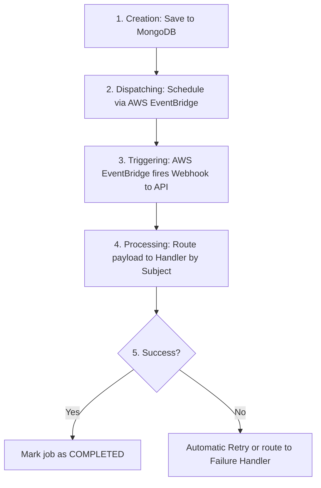

#  Background Job Manager

A robust, event-driven Node.js microservice designed to orchestrate, schedule, and process asynchronous background jobs. 

Whether you need to send bulk notifications, process large files, or sync databases, this service offloads heavy tasks from your main application so it can remain fast and responsive.

---

##  How It Works (The Lifecycle of a Job)

1. **Creation:** A job is created and saved to the MongoDB database (`clt_background_jobs`) with a `PENDING` status.
2. **Dispatching:** The system uses **AWS EventBridge Scheduler** to schedule the job for immediate or future execution.
3. **Triggering:** At the scheduled time, AWS EventBridge sends a secure Webhook back to this application's API.
4. **Processing:** The system routes the webhook to the correct **Handler** based on the job's "Subject" (e.g., `user:sync`).
5. **Completion/Retry:** If successful, the job is marked `COMPLETED`. If it fails, it is automatically retried based on configured limits, or sent to a **Failure Handler**.



---

##  Features

- **AWS EventBridge Integration**: Native scheduling and dispatching using `@aws-sdk/client-scheduler` and `@aws-sdk/client-eventbridge`.
- **Secure Webhooks**: Verifies incoming AWS Lambda/EventBridge invocations using HTTP headers (`x-event-secret`).
- **Modular Architecture**: Clean separation of concerns with dedicated handlers for processing jobs and handling failures.
- **Database Tracking**: Jobs are tracked and persisted using MongoDB (`clt_background_jobs` collection).
- **Automatic Retries**: Built-in retry mechanism with customizable attempt limits per job type.

---

##  Project Structure

```text
src/
├── controllers/
│   └── background-jobs.controller.js # API controllers for job management
├── lib/
│   └── background-job-worker/  # Core engine (Job Manager, Dispatchers, Retries)
├── models/
│   └── clt_background_jobs.js  # MongoDB schema for tracking job states
├── routes/
│   ├── background-jobs.route.js # Management API endpoints
│   └── lambda.routes.js        # Webhook endpoints triggered by AWS
└── services/
    └── background-jobs/
        ├── handlers/           # 🟢 Business logic for successful jobs
        ├── failure-handlers/   # 🔴 Fallback logic when jobs fail
        ├── index.js            # Manager initialization & security setup
        └── subjects.js         # Dictionary of all allowed Job Topics
```

---

##  Installation & Setup

### Prerequisites
- MongoDB instance (local or MongoDB Atlas)
- AWS Account 

### 1. Clone the repository
```bash
git clone https://github.com/emilomanishm/background-job-manager.git
cd background-job-manager
```

### 2. Install dependencies
```bash
npm install
```

### 3. Environment Variables
Create a `.env` file in the root directory. 


```env
# Server & Database
PORT=3000
MONGO_URI=mongodb://localhost:27017/your-database

# AWS Configuration (Used by EventBridge Dispatcher)
AWS_REGION=ap-south-1
AWS_ACCESS_KEY_ID=your_aws_access_key
AWS_SECRET_ACCESS_KEY=your_aws_secret_key

# AWS Lambda/Scheduler Targets
AWS_LAMBDA_ARN=arn:aws:lambda:ap-south-1:123456789012:function:your-function
AWS_SCHEDULER_ROLE_ARN=arn:aws:iam::123456789012:role/your-scheduler-role

# Webhook Security (Must match the header sent by AWS)
LAMBDA_WEBHOOK_SECRET=your_super_secret_webhook_token
```

### 4. Run the Application

**Development Mode (Auto-reloads on file changes):**
```bash
npm run dev
```

**Production Mode:**
Runs the standard Node.js server.
```bash
npm start
```

## Job Subjects (Topics)

The application routes incoming tasks based on predefined subjects. The following subjects are currently supported in `src/services/background-jobs/subjects.js`:

- **User Operations**: 
  - `user:sync`
  - `user:update`
  - `user:delete`
- **Notifications**: 
  - `notification:send`
  - `notification:bulk`
- **Post Processing**: 
  - `post:process`
  - `post:analyze`
- **Reporting**: 
  - `report:generate`
  - `report:export`

---

## API Routes

The Express application exposes HTTP endpoints to receive webhooks and manage tasks. These are divided into two main files:

### 1. Webhook Routes (`src/routes/lambda.routes.js`)
These routes act as the bridge between AWS and your application. When AWS EventBridge Scheduler triggers a job, it makes a secure `POST` request to this route. The route intercepts the payload and passes it directly to the `BackgroundJobManager` for execution.

| Method | Path | Description |
|--------|------|-------------|
| POST | `/api/lambda/jobs` | Lambda webhook (internal) |


### 2. Management Routes (`src/routes/background-jobs.route.js`)
These are internal API endpoints used by your main application to interact with the job system. Typically, these include endpoints to manually create/dispatch a new job, retrieve the execution status of a pending job, or manually retry a failed job.

| Method | Path | Description |
|--------|------|-------------|
| POST | `/api/v1/background-jobs/trigger` | Enqueue a new job |
| GET  | `/api/v1/background-jobs` | List jobs (filter by status, subject) |
| GET  | `/api/v1/background-jobs/:jobId` | Fetch single job |
| POST | `/api/v1/background-jobs/:jobId/retry` | Re-enqueue a failed job |

---

##  Webhook Security

When AWS EventBridge/Lambda triggers a job execution, it hits the webhook endpoint defined in `lambda.routes.js`. 

This request is verified by the `verifyHttp` function inside `src/services/background-jobs/index.js`, which ensures that the `x-event-secret` header passed in the request matches your local `LAMBDA_WEBHOOK_SECRET` environment variable.